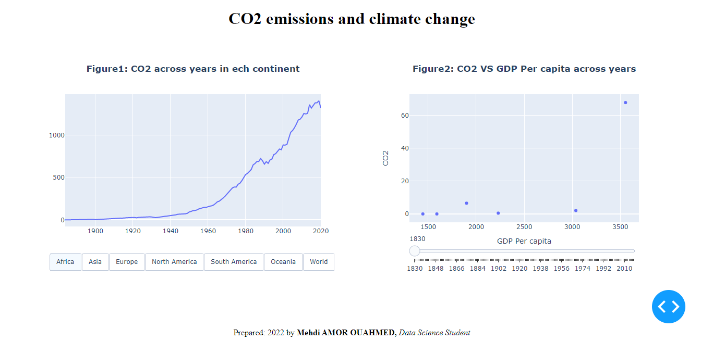

# First-dashboard-using-Plotly-Dash
## Interactive visualization dashboard in Python with Panel
The data used is about co2 emission in countries between 1949 and 2020. You'll find more information about the data.
To serve the dashboard locally, use the command:
```
python app.py
```

